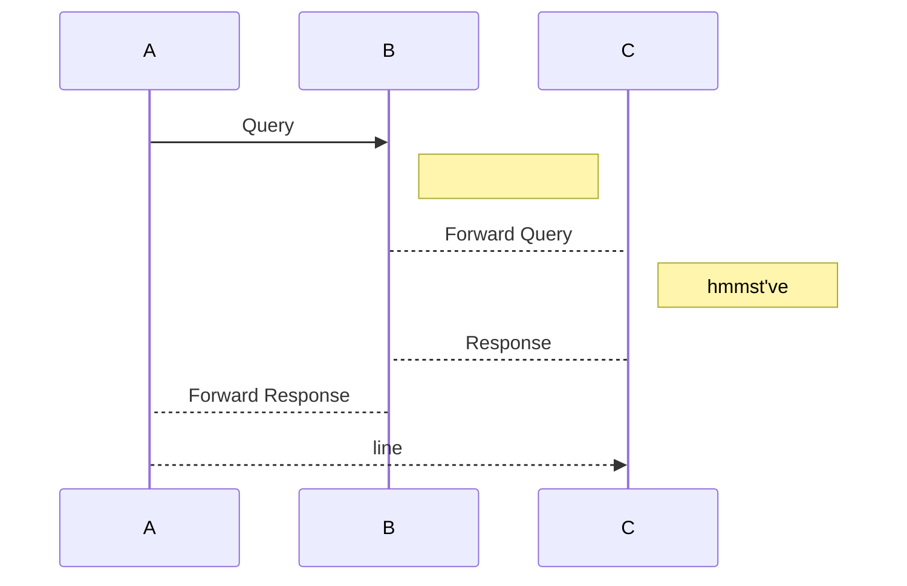
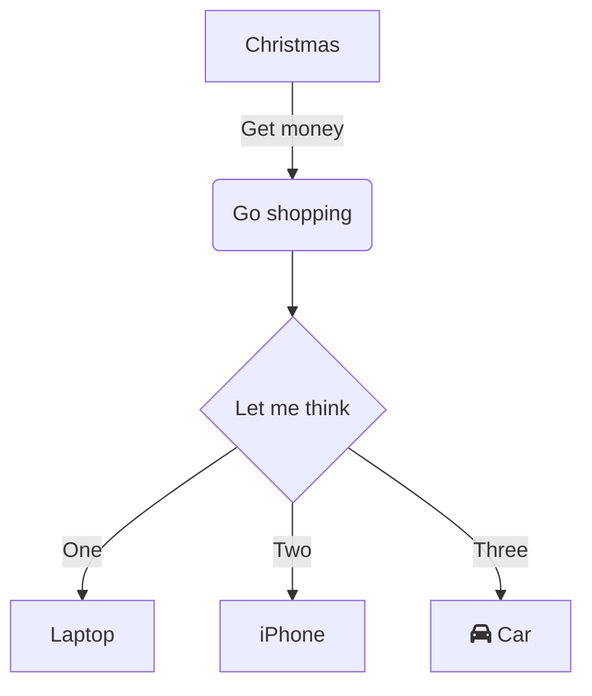
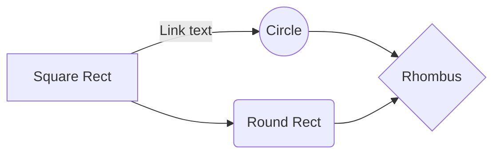

Headers 

# This is an h1 tag 
# hello 
## This is an h2 tag 
###### This is an h6 

# Emphasis

Emphasis, aka italics, with *asterisks* or _underscores_.

Strong emphasis, aka bold, with **asterisks** or __underscores__.

Combined emphasis with **asterisks and _underscores_**.

Strikethrough uses two tildes. ~~Scratch this.~~


# Lists

## Unordered
* Item 1
* Item 2
  * Item 2a
  * Item 2b

## Ordered
1. Item 1
1. Item 2
1. Item 3
   1. Item 3a
   1. Item 3b

# Links
[I'm an inline-style link](https://www.google.com)

[I'm a reference-style link][Arbitrary case-insensitive reference text]

[You can use numbers for reference-style link definitions][1]

Or leave it empty and use the [link text itself]

URLs and URLs in angle brackets will automatically get turned into links. 
http://www.example.com or <http://www.example.com> and sometimes 
example.com (but not on Github, for example).

Some text to show that the reference links can follow later.

[arbitrary case-insensitive reference text]: https://www.mozilla.org
[1]: http://slashdot.org
[link text itself]: http://www.reddit.com

# Blockquotes
As Kanye West said:

> We're living the future so
> the present is our past.

# Inline Code

I think you should use an
`<addr>` element here instead.

#Code and Syntax Highlighting

Inline `code` has `back-ticks P` it.

Blocks of code have 
    ```three back-ticks
        around it
    ```
## javascript
```javascript
var s = "Hello World";
alert(s);
```
## python
```python
s = "Hello World"
print s
```
 
```
No language indicated, so no syntax highlighting. 
But let's throw in a <b>tag</b>.
```
## Mermaid UML diagrams
### This requires the Mermaid plugin for VS code 
#### Ctrl + P and paste the below

> ext install vstirbu.vscode-mermaid-preview

###Sequence Diagrams

###Graphs

###Flowcharts
